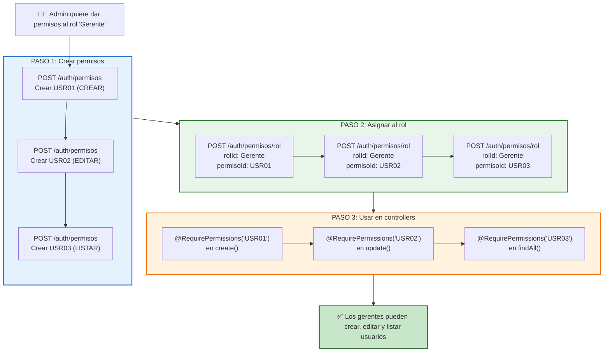
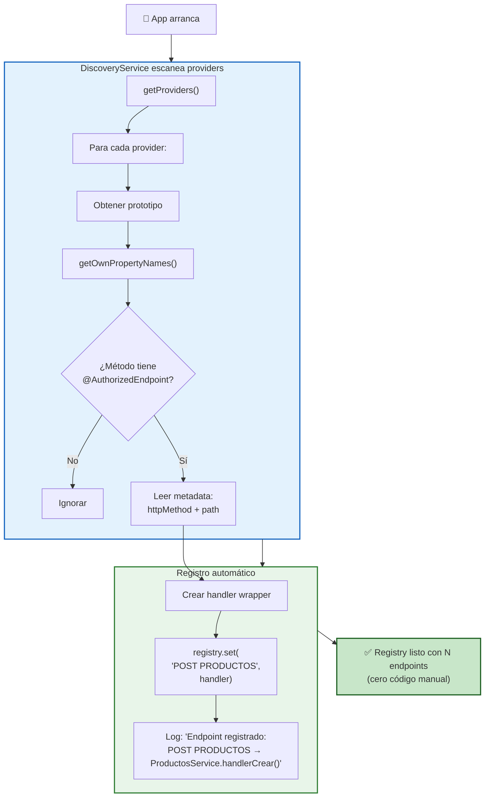
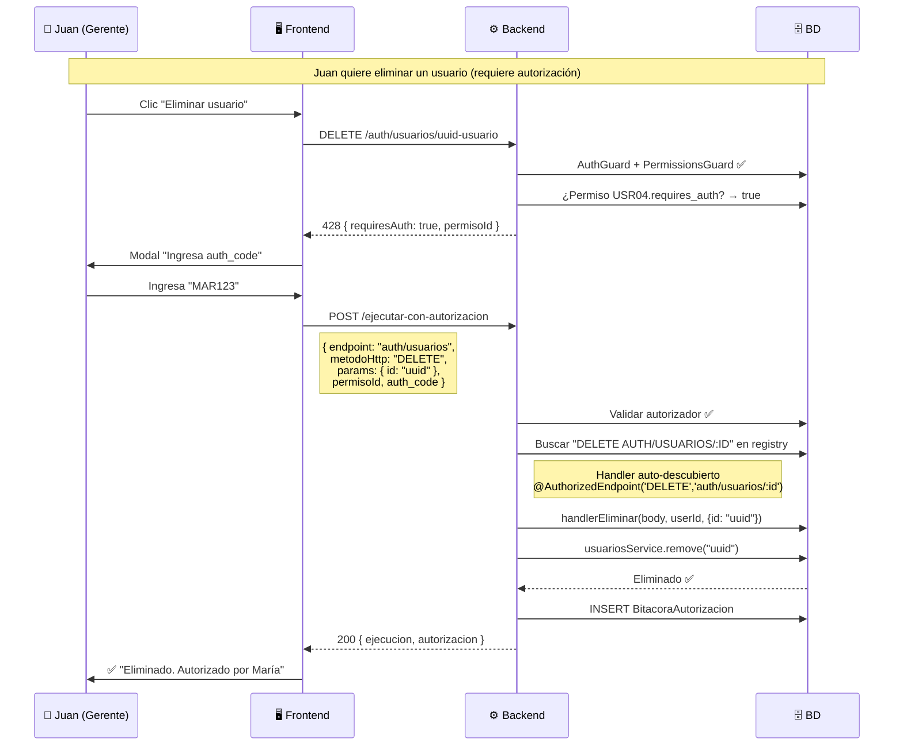

# 🔐 EjecutarConAutorizacion + Sistema de Permisos — Guía Completa

> **Objetivo:** Entender la factibilidad y escalabilidad del endpoint `ejecutarConAutorizacion`, cómo funciona el sistema de permisos de punta a punta, cómo asignar permisos a roles, y qué clases intervienen en cada flujo.

---

## 📌 Índice

1. [Análisis de ejecutarConAutorizacion](#1--análisis-de-ejecutarconautorizacion)
2. [El sistema de permisos: cómo funciona](#2--el-sistema-de-permisos-cómo-funciona)
3. [Cómo asignar permisos a un rol (paso a paso)](#3--cómo-asignar-permisos-a-un-rol-paso-a-paso)
4. [Clases que intervienen en el flujo](#4--clases-que-intervienen-en-el-flujo)
5. [Diagramas de flujo completos](#5--diagramas-de-flujo-completos)
6. [Ejemplos prácticos](#6--ejemplos-prácticos)

---

## 1. 📊 Análisis de ejecutarConAutorizacion

### ¿Qué hace este endpoint?

`POST /v1/auth/usuarios/ejecutar-con-autorizacion` es un **endpoint unificado** que combina autorización + ejecución en un solo request. El frontend envía todo lo necesario de una vez:

```json
{
  "endpoint": "auth/usuarios",
  "metodoHttp": "POST",
  "body": { "nombre1": "Juan", "apellido1": "Pérez", "rolId": "uuid-rol" },
  "permisoId": "uuid-permiso-usr01",
  "auth_code": "MAR123"
}
```

Para endpoints con parámetros de ruta (PUT/DELETE), se usa el campo `params`:

```json
{
  "endpoint": "auth/usuarios",
  "metodoHttp": "DELETE",
  "params": { "id": "550e8400-e29b-41d4-a716-446655440000" },
  "permisoId": "uuid-permiso-usr04",
  "auth_code": "MAR123"
}
```

### ¿Es factible y escalable?

**Sí, es factible y escalable.** La implementación actual usa **auto-descubrimiento** con `DiscoveryService` de NestJS:

```
Al arrancar la app:
  DiscoveryService escanea TODOS los providers registrados
    → Busca métodos decorados con @AuthorizedEndpoint
    → Los registra automáticamente en el registry (Map)
    → Cero código manual

Al recibir una petición:
  Controller → AuthorizationExecutorService.ejecutarConAutorizacion()
    1. Valida auth_code, permisos, auto-autorización
    2. Busca el handler en el registry: "DELETE AUTH/USUARIOS/:ID"
    3. Ejecuta el handler DIRECTAMENTE (sin HTTP)
    4. Registra en bitácora
    5. Retorna resultado + auditoría
```

#### ✅ Ventajas

| Ventaja | Explicación |
|---|---|
| **Sin overhead de red** | Llamada directa al service, no HTTP a localhost |
| **Sin doble JWT** | No necesita re-validar token en cada salto |
| **Auto-descubrimiento** | Agregar un endpoint = decorar un método. Se registra solo |
| **Soporta `:id`** | Campo `params` en el DTO para PUT/DELETE con parámetros de ruta |
| **Sin acoplamiento** | `AuthorizationExecutorService` no conoce a ningún service específico |
| **Un solo request** | El frontend no necesita hacer 3-4 llamadas secuenciales |
| **Bitácora automática** | Se registra quién autorizó, para qué, y cuándo |
| **Manejo centralizado de errores** | Si el handler falla, se propaga con contexto (AUT-21-09) |

#### ⚠️ Limitaciones residuales

| Limitación | Impacto | Estado |
|---|---|---|
| ~~Registry estático~~ | ~~Los endpoints se registran manualmente~~ | ✅ Resuelto: auto-descubrimiento con `@AuthorizedEndpoint` |
| ~~No soporta `:id`~~ | ~~PUT/DELETE necesitan el id en el body~~ | ✅ Resuelto: campo `params` en el DTO |
| ~~Acoplamiento al service~~ | ~~Executor conoce a UsuariosService~~ | ✅ Resuelto: DiscoveryService escanea todos los providers |
| Un solo autorizador | Solo un auth_code por operación | Diseño intencional |
| Sin transacciones | Si el handler falla después de la bitácora, queda registro pero no ejecución | Se podría envolver en transacción |

---

## 🔧 Cómo funciona el auto-descubrimiento

### El decorador `@AuthorizedEndpoint`

Cualquier service puede exponer un método como endpoint autorizable usando el decorador:

```typescript
import { AuthorizedEndpoint } from 'src/common/decorators/authorized-endpoint.decorator';

@Injectable()
export class ProductosService {

  @AuthorizedEndpoint('POST', 'productos')
  async handlerCrear(body: any, _solicitanteId: string) {
    return this.crear(body);
  }

  @AuthorizedEndpoint('PUT', 'productos/:id')
  async handlerActualizar(
    body: any,
    _solicitanteId: string,
    params: Record<string, string>,
  ) {
    return this.actualizar(params.id, body);
  }

  @AuthorizedEndpoint('DELETE', 'productos/:id')
  async handlerEliminar(
    body: any,
    _solicitanteId: string,
    params: Record<string, string>,
  ) {
    return this.eliminar(params.id);
  }

  // Los métodos originales del service se mantienen intactos
  async crear(dto: CreateProductoDto) { /* ... */ }
  async actualizar(id: string, dto: UpdateProductoDto) { /* ... */ }
  async eliminar(id: string) { /* ... */ }
}
```

### Firma del handler

Los métodos decorados con `@AuthorizedEndpoint` reciben **3 argumentos**:

| Argumento | Tipo | Descripción |
|---|---|---|
| `body` | `any` | Body de la petición original |
| `solicitanteId` | `string` | UUID del usuario logueado (del JWT) |
| `params` | `Record<string, string>` | Parámetros de ruta (ej: `{ id: "uuid" }`) |

### Cómo se registra automáticamente

```
1. NestJS arranca y registra todos los providers (services)
2. AuthorizationExecutorService.onModuleInit() se ejecuta
3. Usa DiscoveryService.getProviders() para obtener todos los providers
4. Para cada provider, inspecciona el prototipo buscando métodos
5. Usa Reflector para leer la metadata de @AuthorizedEndpoint
6. Si el método tiene el decorador, crea un handler wrapper y lo registra:
   - Key: "POST PRODUCTOS", "PUT PRODUCTOS/:ID", etc.
   - Value: función que llama al método del service con los argumentos correctos
7. Log: "Registry de autorización: 4 endpoints auto-descubiertos"
```

### Para agregar un nuevo módulo

**Solo 2 pasos — no tocar `AuthorizationExecutorService`:**

```typescript
// 1. En tu service, importar y decorar los métodos:
import { AuthorizedEndpoint } from 'src/common/decorators/authorized-endpoint.decorator';

@Injectable()
export class InventarioService {

  @AuthorizedEndpoint('POST', 'inventario/movimientos')
  async handlerCrearMovimiento(body: any, _solicitanteId: string) {
    return this.crearMovimiento(body);
  }

  @AuthorizedEndpoint('DELETE', 'inventario/movimientos/:id')
  async handlerEliminarMovimiento(
    body: any,
    _solicitanteId: string,
    params: Record<string, string>,
  ) {
    return this.eliminarMovimiento(params.id);
  }

  // Métodos originales...
}

// 2. ¡Listo! El executor lo descubre automáticamente al arrancar.
```

### Registro manual (extensibilidad)

Si necesitas registrar un handler sin el decorador (tests, configuración dinámica):

```typescript
// En cualquier módulo o servicio:
executor.registrarEndpoint('POST CUSTOM/ENDPOINT', (body, userId) => {
  return customLogic(body);
});
```

---

## 2. 🔑 El sistema de permisos: cómo funciona

### Las 3 tablas fundamentales

```
┌─────────────────────────────────────────────────────────────┐
│                        Permiso                               │
│  Catálogo de todos los permisos disponibles                  │
│  ───────────────────────────────────────────                 │
│  id          UUID (PK)                                       │
│  codigo      VARCHAR(20) UNIQUE  ← "USR01", "USR02"         │
│  modulo      VARCHAR(50)         ← "USR", "PROD"            │
│  accion      VARCHAR(50)         ← "CREAR", "EDITAR"        │
│  descripcion VARCHAR(250)        ← "Permite crear usuarios"  │
│  activo      BOOLEAN             ← ¿Está habilitado?        │
│  requires_auth BOOLEAN          ← ¿Necesita autorización?   │
└──────────┬──────────────────────────────────┬───────────────┘
           │                                  │
           ▼                                  ▼
┌─────────────────────────┐   ┌──────────────────────────────┐
│      Permiso_Rol        │   │       Permiso_Usuario         │
│  ¿Qué permisos tiene    │   │  Excepciones individuales     │
│  cada ROL?              │   │  (por encima del rol)         │
│  ────────────────────── │   │  ──────────────────────────── │
│  rolId      UUID (PK)   │   │  usuarioId  UUID (PK)         │
│  permisoId  UUID (PK)   │   │  permisoId  UUID (PK)         │
│  autoriza   BOOLEAN     │   │  permitido  BOOLEAN           │
│             ↑           │   │             ↑                  │
│  ¿Este rol puede        │   │  ¿Este usuario tiene acceso?  │
│  AUTORIZAR este         │   │  true=concede, false=niega    │
│  permiso?               │   │                               │
│                          │   │  autoriza    BOOLEAN           │
│                          │   │             ↑                  │
│                          │   │  ¿Este usuario puede          │
│                          │   │  AUTORIZAR este permiso?      │
└─────────────────────────┘   └──────────────────────────────┘
```

### La diferencia clave: `autoriza` vs `permitido`

| Campo | Tabla | Significado | Ejemplo |
|---|---|---|---|
| **`permitido`** | Permiso_Usuario | "¿Este usuario **puede ejecutar** esta acción?" | Juan tiene `permitido=true` para USR01 → Juan puede crear usuarios |
| **`autoriza`** | Permiso_Rol / Permiso_Usuario | "¿Este usuario/rol **puede aprobar** que otros ejecuten esta acción?" | María tiene `autoriza=true` para USR01 → María puede aprobar que otros creen usuarios |

**Analogía simple:**
- `permitido` = "Tienes llave para abrir la puerta" (acceso)
- `autoriza` = "Puedes dar llaves a otros" (poder de aprobación)

### La cadena de guards (validación automática)

```
Petición HTTP
    │
    ▼
┌─────────────────────────────────────────────┐
│ 1. ValidationPipe (GLOBAL)                  │
│    Valida el body contra el DTO             │
└──────────┬──────────────────────────────────┘
           ▼
┌─────────────────────────────────────────────┐
│ 2. AuthGuard (GLOBAL)                       │
│    Verifica token JWT                       │
│    Carga request.user con el usuario        │
└──────────┬──────────────────────────────────┘
           ▼
┌─────────────────────────────────────────────┐
│ 3. PermissionsGuard (GLOBAL)                │
│    Lee @RequirePermissions('USR01')         │
│    Algoritmo: admin → excepción → rol       │
└──────────┬──────────────────────────────────┘
           ▼
┌─────────────────────────────────────────────┐
│ 4. ThrottlerGuard (GLOBAL)                  │
│    Rate limiting                            │
└──────────┬──────────────────────────────────┘
           ▼
┌─────────────────────────────────────────────┐
│ 5. AdminOnlyGuard (LOCAL)                   │
│    Solo en rutas con @AdminOnly()           │
└──────────┬──────────────────────────────────┘
           ▼
    Controller → Service → Repository → BD
```

### El flujo de autorizaciones (bitácora)

```
┌──────────┐  1. POST /usuarios (intentar)     ┌──────────┐
│ Frontend  │ ────────────────────────────────> │ Backend  │
└──────────┘                                   └────┬─────┘
                                                     │
                                               AuthGuard ✅
                                               PermissionsGuard ✅
                                               ¿requires_auth?
                                               → SÍ
                                                     │
                                               ┌─────▼──────────────┐
                                               │ Retorna 428        │
                                               │ { requiresAuth,     │
                                               │   permisoId,        │
                                               │   permisoCodigo }   │
                                               └─────┬──────────────┘
                                                     │
┌──────────┐  2. POST /ejecutar-con-autorizacion     │
│ Frontend  │ ──────────────────────────────────────>│
│           │  { endpoint, metodoHttp, body, params, │
│           │    permisoId, auth_code }              │
└──────────┘                                        │
                                               ┌─────▼──────────────┐
                                               │ FASE 1: Validar    │
                                               │ - Autorizador OK?  │
                                               │ - Tiene autoriza?  │
                                               │ - No auto-auth?    │
                                               └─────┬──────────────┘
                                               ┌─────▼──────────────┐
                                               │ FASE 2: Ejecutar   │
                                               │ Handler auto-      │
                                               │ descubierto ✅     │
                                               └─────┬──────────────┘
                                               ┌─────▼──────────────┐
                                               │ FASE 3: Bitácora   │
                                               │ INSERT ✅           │
                                               └─────┬──────────────┘
                                               ┌─────▼──────────────┐
                                               │ FASE 4: Retorno    │
                                               │ { ejecucion,       │
                                               │   autorizacion }   │
                                               └────────────────────┘
```

---

## 3. 📋 Cómo asignar permisos a un rol (paso a paso)

### Paso 1: Crear el permiso (si no existe)

```bash
# Crear permiso para "Crear usuarios"
curl -X POST http://localhost:3000/v1/auth/permisos \
  -H "Content-Type: application/json" \
  -H "Authorization: Bearer <token-admin>" \
  -d '{
    "codigo": "USR01",
    "modulo": "USR",
    "accion": "CREAR",
    "descripcion": "Permite crear nuevos usuarios en el sistema",
    "activo": true,
    "requires_auth": false
  }'
```

**Campos importantes:**

| Campo | Qué significa | Ejemplo |
|---|---|---|
| `codigo` | Código único (se usa en `@RequirePermissions`) | `"USR01"` |
| `modulo` | Módulo al que pertenece | `"USR"`, `"PROD"` |
| `accion` | Acción que habilita | `"CREAR"`, `"EDITAR"`, `"LISTAR"` |
| `requires_auth` | `false` = acceso directo / `true` = necesita autorización | `false` |

### Paso 2: Asignar el permiso al rol

```bash
# Asignar USR01 al rol "Operador"
curl -X POST http://localhost:3000/v1/auth/permisos/rol \
  -H "Content-Type: application/json" \
  -d '{
    "rolId": "uuid-del-rol-operador",
    "permisoId": "uuid-del-permiso-usr01",
    "autoriza": false
  }'
```

| `autoriza` | Significado |
|---|---|
| `false` | Puede ejecutar la acción, pero NO puede aprobar a otros |
| `true` | Puede aprobar que otros ejecuten esta acción |

### Paso 3: Usar el permiso en el controller

```typescript
@Controller('auth/usuarios')
export class UsuariosController {

  @Post()
  @RequirePermissions('USR01')
  create(@Body() dto: CreateUsuarioDto) {
    return this.service.create(dto);
  }

  @Put(':id')
  @RequirePermissions('USR02')
  update(@Param('id') id: string, @Body() dto: UpdateUsuarioDto) {
    return this.service.update(id, dto);
  }

  @Delete(':id')
  @RequirePermissions('USR04')
  remove(@Param('id') id: string) {
    return this.service.remove(id);
  }
}
```

### Paso 4: (Opcional) Excepciones individuales

```bash
# Dar permiso USR01 directamente a Juan (excepción de su rol)
POST /auth/permisos/usuario  {
  "usuarioId": "uuid-de-juan",
  "permisoId": "uuid-de-usr01",
  "permitido": true,
  "autoriza": false
}

# Quitar permiso USR03 a María (niega, aunque su rol lo tenga)
POST /auth/permisos/usuario  {
  "usuarioId": "uuid-de-maria",
  "permisoId": "uuid-de-usr03",
  "permitido": false,
  "autoriza": false
}
```

> **Prioridad:** `Permiso_Usuario` tiene prioridad sobre `Permiso_Rol`.

### Visualizar la matriz de permisos de un rol

```bash
curl "http://localhost:3000/v1/auth/permisos/rol/matriz?rolId=uuid-rol&todos=true"
```

```json
{
  "data": [
    { "codigo": "USR01", "modulo": "USR", "accion": "CREAR", "asignado": true },
    { "codigo": "USR02", "modulo": "USR", "accion": "EDITAR", "asignado": true },
    { "codigo": "USR03", "modulo": "USR", "accion": "LISTAR", "asignado": false }
  ]
}
```

---

## 4. 🧩 Clases que intervienen en el flujo

### Flujo 1: Permisos (validación automática)

| Categoría | Clase | Archivo | Responsabilidad |
|---|---|---|---|
| **Decorador** | `@RequirePermissions` | `permissions.decorator.ts` | Etiqueta endpoint con códigos de permiso |
| **Decorador** | `@AdminOnly` | `admin.decorator.ts` | Etiqueta endpoint como solo-admin |
| **Decorador** | `@Public` | `public.decorator.ts` | Etiqueta endpoint como público |
| **Decorador** | `@GetUser` | `get-user.decorator.ts` | Extrae usuario del request |
| **Guard** | `AuthGuard` | `auth.guard.ts` | Verifica JWT, carga usuario |
| **Guard** | `PermissionsGuard` | `permissions.guard.ts` | Valida permisos (admin → excepción → rol) |
| **Guard** | `AdminOnlyGuard` | `admin-only.guard.ts` | Verifica que sea admin |
| **Service** | `PermisoService` | `permiso.service.ts` | CRUD de permisos + verificarAutorizacion |
| **Service** | `PermisoRolService` | `permiso-rol.service.ts` | Asignar permisos a roles + matriz |
| **Service** | `PermisoUsuarioService` | `permiso-usuario.service.ts` | Excepciones individuales |

### Flujo 2: EjecutarConAutorizacion (auto-descubrimiento)

| Categoría | Clase | Archivo | Responsabilidad |
|---|---|---|---|
| **Decorador** | `@AuthorizedEndpoint` | `authorized-endpoint.decorator.ts` | Marca métodos de service como endpoints autorizables |
| **Service** | `AuthorizationExecutorService` | `authorization-executor.service.ts` | Auto-descubre handlers + valida autorización + ejecuta + bitácora |
| **DTO** | `EjecutarConAutorizacionDto` | `ejecutar-con-autorizacion.dto.ts` | Datos de entrada (endpoint, metodoHttp, body, params, permisoId, auth_code) |
| **Controller** | `UsuariosController` | `usuarios.controller.ts` | Endpoint `ejecutar-con-autorizacion` |
| **Service** | Cualquier service decorado | (varios) | Handlers que ejecutan la lógica de negocio |
| **NestJS** | `DiscoveryService` | `@nestjs/core` | Escanea providers para auto-descubrir handlers |
| **NestJS** | `Reflector` | `@nestjs/core` | Lee metadata de decoradores |

### Resumen completo de todas las clases

| Categoría | Clase | Archivo |
|---|---|---|
| **Decorador** | `@RequirePermissions` | `permissions.decorator.ts` |
| **Decorador** | `@AdminOnly` | `admin.decorator.ts` |
| **Decorador** | `@Public` | `public.decorator.ts` |
| **Decorador** | `@GetUser` | `get-user.decorator.ts` |
| **Decorador** | `@AuthorizedEndpoint` | `authorized-endpoint.decorator.ts` |
| **Guard** | `AuthGuard` | `auth.guard.ts` |
| **Guard** | `PermissionsGuard` | `permissions.guard.ts` |
| **Guard** | `AdminOnlyGuard` | `admin-only.guard.ts` |
| **Service** | `PermisoService` | `permiso.service.ts` |
| **Service** | `PermisoRolService` | `permiso-rol.service.ts` |
| **Service** | `PermisoUsuarioService` | `permiso-usuario.service.ts` |
| **Service** | `UsuariosService` | `usuarios.service.ts` |
| **Service** | `AuthorizationExecutorService` | `authorization-executor.service.ts` |
| **Entity** | `Permiso` | `permiso.entity.ts` |
| **Entity** | `PermisoRol` | `permiso-rol.entity.ts` |
| **Entity** | `PermisoUsuario` | `permiso-usuario.entity.ts` |
| **Entity** | `Usuario` | `usuario.entity.ts` |
| **Entity** | `Rol` | `rol.entity.ts` |
| **Entity** | `BitacoraAutorizacion` | `bitacora-autorizacion.entity.ts` |
| **DTO** | `CreatePermisoDto` | `permiso.dto.ts` |
| **DTO** | `CreatePermisoRolDto` | `permiso-rol.dto.ts` |
| **DTO** | `CreatePermisoUsuarioDto` | `permiso-usuario.dto.ts` |
| **DTO** | `EjecutarConAutorizacionDto` | `ejecutar-con-autorizacion.dto.ts` |
| **Controller** | `PermisosController` | `permisos.controller.ts` |
| **Controller** | `UsuariosController` | `usuarios.controller.ts` |

---

## 5. 📊 Diagramas de flujo completos

### Flujo completo: Agregar permisos a un rol



### Flujo de auto-descubrimiento al arrancar



### Flujo completo: Petición con autorización



---

## 6. 💡 Ejemplos prácticos

### Ejemplo 1: Agregar un módulo completo de "Productos"

```typescript
// 1. En ProductosService, decorar los handlers:
@Injectable()
export class ProductosService {

  @AuthorizedEndpoint('POST', 'productos')
  async handlerCrear(body: any, _solicitanteId: string) {
    return this.crear(body as CreateProductoDto);
  }

  @AuthorizedEndpoint('GET', 'productos')
  async handlerListar(body: any, _solicitanteId: string) {
    return this.listar(body as PaginationDto);
  }

  @AuthorizedEndpoint('PUT', 'productos/:id')
  async handlerActualizar(
    body: any,
    _solicitanteId: string,
    params: Record<string, string>,
  ) {
    return this.actualizar(params.id, body as UpdateProductoDto);
  }

  @AuthorizedEndpoint('DELETE', 'productos/:id')
  async handlerEliminar(
    body: any,
    _solicitanteId: string,
    params: Record<string, string>,
  ) {
    return this.eliminar(params.id);
  }

  // Métodos originales del service...
  async crear(dto: CreateProductoDto) { /* ... */ }
  async listar(dto: PaginationDto) { /* ... */ }
  async actualizar(id: string, dto: UpdateProductoDto) { /* ... */ }
  async eliminar(id: string) { /* ... */ }
}

// 2. ¡Listo! Se auto-registra al arrancar. No tocar AuthorizationExecutorService.
```

### Ejemplo 2: Asignar permisos y usar en controller

```bash
# Crear permisos
POST /auth/permisos  { "codigo": "PROD01", "modulo": "PROD", "accion": "CREAR" }
POST /auth/permisos  { "codigo": "PROD02", "modulo": "PROD", "accion": "EDITAR" }
POST /auth/permisos  { "codigo": "PROD04", "modulo": "PROD", "accion": "ELIMINAR", "requires_auth": true }

# Asignar al rol
POST /auth/permisos/rol  { "rolId": "rol-almacen", "permisoId": "prod01", "autoriza": false }
POST /auth/permisos/rol  { "rolId": "rol-almacen", "permisoId": "prod04", "autoriza": false }

# Admin con autorización
POST /auth/permisos/rol  { "rolId": "rol-admin", "permisoId": "prod04", "autoriza": true }
```

```typescript
// En ProductosController:
@Controller('productos')
export class ProductosController {

  @Post()
  @RequirePermissions('PROD01')
  create(@Body() dto: CreateProductoDto) {
    return this.service.crear(dto);
  }

  @Delete(':id')
  @RequirePermissions('PROD04')  // PROD04 tiene requires_auth=true
  remove(@Param('id') id: string) {
    return this.service.eliminar(id);
  }
}
```

### Ejemplo 3: Ejecutar con autorización (DELETE con :id)

```json
// Frontend envía:
{
  "endpoint": "productos",
  "metodoHttp": "DELETE",
  "params": { "id": "550e8400-e29b-41d4-a716-446655440000" },
  "permisoId": "uuid-permiso-prod04",
  "auth_code": "MAR123"
}
```

El executor busca `"DELETE PRODUCTOS/:ID"` en el registry → encuentra `handlerEliminar` → llama `handlerEliminar({}, userId, { id: "uuid" })` → que internamente llama `this.eliminar("uuid")`.

---

## 📝 Resumen ejecutivo

| Pregunta | Respuesta |
|---|---|
| **¿Es factible y escalable?** | ✅ Auto-descubrimiento con `@AuthorizedEndpoint` + `DiscoveryService` |
| **¿Cómo agrego un endpoint?** | Decorar un método con `@AuthorizedEndpoint('POST', 'ruta')`. Se registra solo |
| **¿Soporta `:id`?** | ✅ Campo `params` en el DTO + el handler recibe `params.id` |
| **¿Hay acoplamiento?** | No. El executor no conoce ningún service específico |
| **¿Cómo asigno permisos a un rol?** | 1. Crear permiso → 2. Asignar con POST /permisos/rol → 3. @RequirePermissions en controller |
| **¿Qué clases intervienen?** | 5 decoradores, 3 guards, 6+ services, 6 entities, 5 DTOs, 2 controllers |
| **¿autoriza vs permitido?** | `autoriza` = "puedo aprobar a otros" / `permitido` = "puedo ejecutar" |

---

> **Última actualización:** 28 de agosto de 2026
