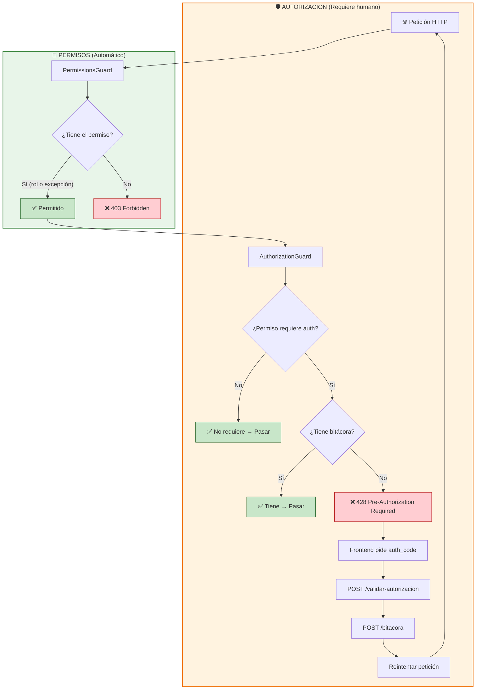
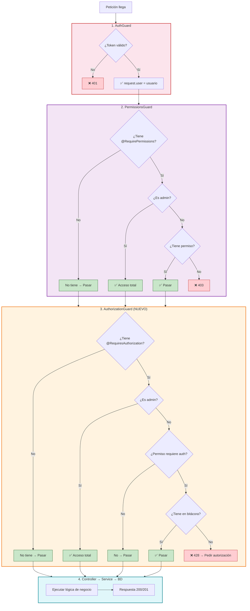
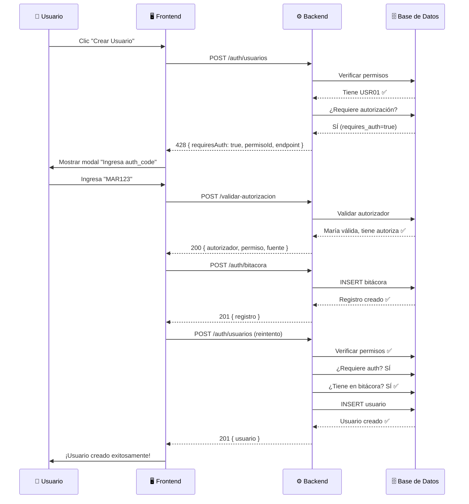

# 🔐 Sistema de Permisos — Flujo Completo y Análisis de Autorizaciones

> **Objetivo:** Entender cómo funciona el sistema de permisos de punta a punta (backend + frontend), cómo el frontend sabe qué endpoints requieren permisos, y cuál es la mejor estrategia para integrar las autorizaciones con la bitácora.

---

## 📌 Índice

1. [Resumen del sistema de permisos](#1--resumen-del-sistema-de-permisos)
2. [Flujo backend: Cómo se validan los permisos](#2--flujo-backend-cómo-se-validan-los-permisos)
3. [Cómo el frontend conoce los permisos](#3--cómo-el-frontend-conoce-los-permisos)
4. [Flujo completo: Ejemplo "Crear Usuario"](#4--flujo-completo-ejemplo-crear-usuario)
5. [El sistema de autorizaciones (bitácora)](#5--el-sistema-de-autorizaciones-bitácora)
6. [¿Por qué no usar un Guard para autorizaciones?](#6--por-qué-no-usar-un-guard-para-autorizaciones)
7. [Análisis de soluciones posibles](#7--análisis-de-soluciones-posibles)
8. [Solución recomendada](#8--solución-recomendada)
9. [Diagramas Mermaid](#9--diagramas-mermaid)

---

## 1. 🧩 Resumen del sistema de permisos

### Las 3 tablas involucradas

```
┌─────────────────────────────────────────────────────────────┐
│                        Permiso                               │
│  id | codigo | modulo | accion | requires_auth | activo     │
│  ───┼────────┼────────┼────────┼───────────────┼────────    │
│  1  | USR01  | USR    | CREAR  | false         | true       │
│  2  | USR02  | USR    | EDITAR | true          | true       │
│  3  | PROD01 | PROD   | CREAR  | false         | true       │
└──────────┬──────────────────────────────────┬───────────────┘
           │                                  │
           ▼                                  ▼
┌─────────────────────────┐   ┌──────────────────────────────┐
│      Permiso_Rol        │   │       Permiso_Usuario         │
│ rolId | permisoId | aut │   │ usuarioId | permisoId | aut  │
│ ──────┼───────────┼─────│   │ ──────────┼───────────┼─────│
│ R-01  | P-01      | 1   │   │ U-05      | P-02      | 1   │
│ R-01  | P-03      | 0   │   │ U-08      | P-01      | 0   │
│ R-02  | P-02      | 1   │   └──────────────────────────────┘
└─────────────────────────┘
```

### ¿Qué significan los campos `autoriza`?

| Campo | Ubicación | Significado |
|---|---|---|
| `Permiso.requires_auth` | Tabla Permiso | Indica si **en general** este permiso requiere autorización previa |
| `Permiso_Rol.autoriza` | Tabla Permiso_Rol | Indica si **el rol** tiene capacidad de **autorizar** acciones que requieren este permiso |
| `PermisoUsuario.autoriza` | Tabla Permiso_Usuario | Indica si **el usuario directamente** tiene capacidad de **autorizar** este permiso |
| `Usuario.autoriza` | Tabla Usuario | Flag general: si el usuario puede autorizar operaciones (kill switch) |

> **Importante:** `autoriza` ≠ `permitido`. El campo `autoriza` significa "este usuario/rol puede dar la aprobación para este permiso". El campo `permitido` (solo en Permiso_Usuario) significa "este usuario tiene acceso a este permiso".

---

## 2. ⚙️ Flujo backend: Cómo se validan los permisos

### Cadena de guards globales (se ejecutan SIEMPRE, en orden)

```
Petición HTTP
    │
    ▼
┌─────────────────────┐
│ 1. ValidationPipe   │  Valida el body contra el DTO
└──────────┬──────────┘
           │
           ▼
┌─────────────────────┐
│ 2. AuthGuard        │  Verifica JWT → carga request.user
│    (GLOBAL)         │
└──────────┬──────────┘
           │
           ▼
┌─────────────────────┐
│ 3. PermissionsGuard │  Verifica @RequirePermissions(...)
│    (GLOBAL)         │  → Busca en Permiso_Usuario → Permiso_Rol
└──────────┬──────────┘
           │
           ▼
┌─────────────────────┐
│ 4. ThrottlerGuard   │  Rate limiting
│    (GLOBAL)         │
└──────────┬──────────┘
           │
           ▼
┌─────────────────────┐
│ 5. AdminOnlyGuard   │  Solo en rutas con @AdminOnly()
│    (LOCAL)          │
└──────────┬──────────┘
           │
           ▼
    Controller → Service → Repository → BD
```

### Cómo se declara un permiso en un endpoint

```typescript
// En el controller:
@Post()
@RequirePermissions('USR01')  // ← Solo quien tenga USR01 puede crear
create(@Body() dto: CreateUsuarioDto) {
  return this.service.create(dto);
}

// Múltiples permisos:
@Put(':id')
@RequirePermissions('USR01', 'USR02')  // ← Necesita AMBOS
update(@Param('id') id: string, @Body() dto: UpdateUsuarioDto) {
  return this.service.update(id, dto);
}
```

### Algoritmo del PermissionsGuard

```
Para cada permiso requerido (ej: 'USR01'):

1. ¿El usuario es admin (esAdmin = true)?
   → SÍ: Acceso TOTAL, no verifica nada más

2. ¿Tiene excepción individual? (Permiso_Usuario)
   → SÍ y permitido = true: ✅ Acceso
   → SÍ y permitido = false: ❌ Denegado
   → NO: continúa

3. ¿Su rol tiene el permiso? (Permiso_Rol)
   → SÍ: ✅ Acceso
   → NO: ❌ Denegado
```

---

## 3. 🖥️ Cómo el frontend conoce los permisos

### El frontend NO adivina los permisos — el backend se los dice

El frontend **no tiene hardcodeados** qué endpoints requieren permisos. Existen **3 estrategias** que se pueden usar (y que este proyecto puede implementar):

#### Estrategia A: El endpoint `/auth/me` retorna los permisos del usuario

```typescript
// GET /auth/me retorna:
{
  "id": "uuid",
  "userName": "jperez",
  "rol": {
    "id": "uuid-rol",
    "nombre": "Gerente",
    "esAdmin": false
  },
  "permisos": [
    { "codigo": "USR01", "modulo": "USR", "accion": "CREAR" },
    { "codigo": "USR02", "modulo": "USR", "accion": "EDITAR", "autoriza": true },
    { "codigo": "PROD01", "modulo": "PROD", "accion": "CREAR" }
  ]
}
```

El frontend guarda esta lista y la usa para:
- **Mostrar/ocultar botones:** Si no tiene `USR01`, no muestra "Crear Usuario"
- **Bloquear rutas:** Si intenta ir a `/usuarios/nuevo` sin `USR01`, lo redirige
- **Habilitar/deshabilitar acciones:** Si tiene `USR02` con `autoriza=true`, muestra el botón "Aprobar"

#### Estrategia B: Guarda la configuración de menús del backend

El sistema de menús (`/auth/accesos`) ya maneja esto. Cada menú tiene permisos asociados:

```typescript
// GET /auth/accesos/menus-rol/:rolId retorna:
[
  {
    "label": "Usuarios",
    "pathApp": "/usuarios",
    "permisos": ["USR01", "USR02", "USR03"],
    "submenus": [
      {
        "label": "Crear Usuario",
        "pathApp": "/usuarios/nuevo",
        "permisos": ["USR01"]
      }
    ]
  }
]
```

#### Estrategia C: El frontend intenta y maneja el 403

```
1. El frontend muestra todos los botones basándose en menús
2. Cuando el usuario hace clic, envía la petición
3. Si el backend retorna 403 (Forbidden):
   - Muestra mensaje "No tienes permisos para esta acción"
   - Puede sugerir "Solicitar autorización a un usuario autorizador"
```

### ¿Qué usa este proyecto actualmente?

Actualmente el proyecto usa una combinación de **Estrategia B y C**:
- Los menús se cargan desde el backend (`/auth/accesos`)
- El frontend oculta/muestra opciones según los menús del rol
- Si un endpoint falla con 403, se muestra el error

> **Recomendación:** Implementar la **Estrategia A** para que el frontend tenga la lista completa de permisos del usuario al hacer login, y usarla para control de UI granular.

---

## 4. 📋 Flujo completo: Ejemplo "Crear Usuario"

### Escenario
- **Solicitante:** Juan (rol: Gerente, tiene permiso USR01)
- **Autorizador:** María (rol: Admin, tiene auth_code "MAR123")
- **Permiso requerido:** USR01 (Crear Usuario)

### Flujo sin autorización (caso normal)

```
┌─────────┐     POST /auth/usuarios          ┌──────────┐
│  Juan   │ ──────────────────────────────── │ Backend  │
│ (Front) │     Body: { nombre1, rolId... }  │          │
└─────────┘                                   └────┬─────┘
                                                    │
                                              ┌─────▼─────┐
                                              │ AuthGuard  │
                                              │ JWT válido │ ✅
                                              └─────┬─────┘
                                                    │
                                              ┌─────▼──────────┐
                                              │PermissionsGuard │
                                              │ @RequirePerms   │
                                              │ ('USR01')       │
                                              │                 │
                                              │ Juan tiene?     │
                                              │ → Permiso_Rol:  │
                                              │   Gerente+USR01 │ ✅
                                              └─────┬───────────┘
                                                    │
                                              ┌─────▼─────┐
                                              │ Controller  │
                                              │ → Service   │
                                              │ → BD INSERT │
                                              └─────┬─────┘
                                                    │
                                              ┌─────▼─────┐
                                              │  201 OK   │
                                              │ Creado ✓  │
                                              └───────────┘
```

### Flujo CON autorización (cuando `requires_auth = true`)

```
┌─────────┐  1. POST /auth/usuarios     ┌──────────┐
│  Juan   │ ────────────────────────── │ Backend  │
│ (Front) │  Body: { ... }             │          │
└─────────┘                             └────┬─────┘
                                              │
                                        AuthGuard ✅
                                        PermissionsGuard ✅
                                              │
                                        ┌─────▼─────────────┐
                                        │ Controller         │
                                        │ ¿Permiso tiene     │
                                        │ requires_auth=true?│
                                        └─────┬─────────────┘
                                              │ SÍ
                                              │
                                        ┌─────▼──────────────────┐
                                        │ Retorna 428            │
                                        │ {                       │
                                        │   "message": "Se requiere│
                                        │   autorización previa", │
                                        │   "requiresAuth": true, │
                                        │   "permisoId": "uuid", │
                                        │   "permisoCodigo":"USR01"│
                                        │ }                       │
                                        └─────┬──────────────────┘
                                              │
┌─────────┐  2. POST /auth/usuarios/         │
│  Juan   │     validar-autorizacion         │
│ (Front) │  Body: {                         │
└─────────┘    auth_code: "MAR123",          │
                permisoId: "uuid-usr01"      │
              }                               │
                                              │
                                        ┌─────▼──────────────────┐
                                        │ Validar:                │
                                        │ 1. María existe? ✅    │
                                        │ 2. María activa? ✅    │
                                        │ 3. María autoriza? ✅  │
                                        │ 4. Permiso existe? ✅  │
                                        │ 5. Rol María tiene     │
                                        │    USR01+autoriza? ✅  │
                                        │ 6. No es auto-auth? ✅ │
                                        └─────┬──────────────────┘
                                              │
                                        ┌─────▼─────┐
                                        │  200 OK   │
                                        │ {         │
                                        │   solicitante, │
                                        │   autorizador, │
                                        │   permiso,     │
                                        │   fuente: "rol"│
                                        │ }              │
                                        └─────┬─────┘
                                              │
                                        ┌─────▼──────────────┐
                                        │ 3. Frontend envía   │
                                        │ POST /auth/bitacora │
                                        │ { endpoint, body,   │
                                        │   solicitanteId,    │
                                        │   autorizadorId,    │
                                        │   permisoId }       │
                                        └─────┬──────────────┘
                                              │
                                        ┌─────▼─────┐
                                        │ 4. Backend ahora   │
                                        │    ejecuta la      │
                                        │    creación del    │
                                        │    usuario (201)   │
                                        └───────────┘
```

---

## 5. 📜 El sistema de autorizaciones (bitácora)

### ¿Qué es la bitácora?

La bitácora es un **registro de auditoría** que guarda quién pidió autorización, quién la dio, para qué permiso, y en qué endpoint.

### Tabla Bitacora_Autorizacion

| Campo | Tipo | Descripción |
|---|---|---|
| `id` | UUID | ID del registro |
| `endpoint` | VARCHAR(100) | Ruta que se autorizó (ej: `POST /v1/auth/usuarios`) |
| `metodo_http` | VARCHAR(10) | Método HTTP (POST, PUT, DELETE) |
| `body_request` | NVARCHAR(MAX) | Body completo de la petición original |
| `solicitanteId` | UUID | Quién pidió la autorización |
| `autorizadorId` | UUID | Quién dio la autorización |
| `permisoId` | UUID | Qué permiso se requirió |
| `created_at` | DATETIME | Fecha del registro |

### Flujo actual de autorizaciones

```
Frontend                    Backend                      BD
   │                           │                          │
   │ 1. POST /usuarios         │                          │
   │    (sin autorización)     │                          │
   │ ─────────────────────────>│                          │
   │                           │── ¿requires_auth=true? ──│
   │                           │<─ SÍ ────────────────────│
   │  428: Se requiere auth    │                          │
   │<──────────────────────────│                          │
   │                           │                          │
   │ 2. POST /validar-auth     │                          │
   │    { auth_code, permisoId}│                          │
   │ ─────────────────────────>│                          │
   │                           │── ¿ autorizador válido? ─│
   │                           │── ¿tiene autoriza? ──────│
   │  200: Info de auth        │                          │
   │<──────────────────────────│                          │
   │                           │                          │
   │ 3. POST /bitacora         │                          │
   │    { solicitud + auth }   │                          │
   │ ─────────────────────────>│── INSERT bitácora ───────>│
   │  201: Registro creado     │                          │
   │<──────────────────────────│                          │
   │                           │                          │
   │ 4. POST /usuarios         │                          │
   │    (ahora con auth_code   │                          │
   │     en body o header)     │                          │
   │ ─────────────────────────>│── Ejecuta la creación ──>│
   │  201: Usuario creado      │                          │
   │<──────────────────────────│                          │
```

---

## 6. ❓ ¿Por qué NO usar un Guard para autorizaciones?

### La pregunta natural

> "Si ya tengo `PermissionsGuard` que valida permisos, ¿por qué no creo un `AuthorizationGuard` que valide autorizaciones?"

### Respuesta: Porque las autorizaciones tienen un flujo fundamentalmente diferente

| Aspecto | Permisos (Guard) | Autorizaciones (Bitácora) |
|---|---|---|
| **¿Quién decide?** | El backend automáticamente | Un **humano** (autorizador) decide |
| **¿Cuándo se valida?** | **ANTES** de ejecutar la acción | **DESPUÉS** de la decisión humana |
| **¿Es síncrono?** | Sí — validación instantánea | No — puede tardar horas/días |
| **¿Depende de datos externos?** | No — solo tablas de permisos | Sí — requiere auth_code de otra persona |
| **¿Puede fallar por timeout?** | No | Sí — el autorizador puede no estar disponible |
| **¿Es reject/allow?** | Sí — solo allow o deny | No — puede ser "pendiente", "aprobado", "rechazado" |

### Un Guard NO puede esperar una decisión humana

```typescript
// Esto NO es viable:
@Injectable()
export class AuthorizationGuard implements CanActivate {
  async canActivate(context: ExecutionContext): Promise<boolean> {
    // ❌ ¿Cuánto tiempo esperamos la decisión del autorizador?
    // ❌ ¿Y si el autorizador está en reunión?
    // ❌ ¿Y si el frontend se desconecta?
    // ❌ ¿Y si el usuario cierra el navegador?
    
    const decision = await this.esperarDecisionHumana(...); // ❌ Imposible
    return decision;
  }
}
```

### Lo que un Guard SÍ puede hacer

Un Guard puede **detectar** que se necesita autorización y **rechazar la petición** con información útil:

```typescript
// Esto SÍ es viable y ya se implementa en el service:
if (permiso.requires_auth) {
  return res.status(428).json({
    message: 'Se requiere autorización previa',
    requiresAuth: true,
    permisoId: permiso.id,
    permisoCodigo: permiso.codigo,
    endpoint: `${req.method} ${req.path}`,
  });
}
```

---

## 7. 🔍 Análisis de soluciones posibles

### Solución A: Guard de Pre-Autorización (recomendada)

**Crear un `PreAuthorizationGuard`** que se ejecute DESPUÉS del `PermissionsGuard` y ANTES del controller.

```typescript
// src/common/guards/pre-authorization.guard.ts
@Injectable()
export class PreAuthorizationGuard implements CanActivate {
  constructor(
    private reflector: Reflector,
    @Inject('PERMISO_REPOSITORY')
    private permisoRepository: Repository<Permiso>,
  ) {}

  async canActivate(context: ExecutionContext): Promise<boolean> {
    const request = context.switchToHttp().getRequest();
    const user: Usuario = request.user;
    
    // Obtener el permiso requerido
    const permisoCodigo = this.reflector.getAllAndOverride<string>(
      'requiresAuthorization', 
      [context.getHandler(), context.getClass()]
    );
    
    if (!permisoCodigo) return true; // No requiere autorización
    
    // Admin bypass
    if (user.rol?.esAdmin) return true;
    
    // Buscar el permiso
    const permiso = await this.permisoRepository.findOneBy({ 
      codigo: permisoCodigo 
    });
    
    // Si el permiso NO requiere auth, dejar pasar
    if (!permiso?.requires_auth) return true;
    
    // Si SÍ requiere auth, verificar si ya tiene una autorización válida
    // (buscar en bitácora reciente para este usuario + permiso + endpoint)
    const tieneAutorizacionReciente = await this.verificarBitacora(
      user.id, permiso.id, request.method, request.path
    );
    
    if (!tieneAutorizacionReciente) {
      // Retornar 428 con info para que el frontend pida autorización
      throw new PreAuthorizationRequiredException({
        permisoId: permiso.id,
        permisoCodigo: permiso.codigo,
        endpoint: `${request.method} ${request.path}`,
      });
    }
    
    return true;
  }
}
```

**Ventajas:**
- ✅ Sigues usando el patrón de Guards de NestJS
- ✅ La validación es automática y centralizada
- ✅ El frontend solo maneja un tipo de error (428)
- ✅ Se puede configurar por endpoint con un decorador

**Desventajas:**
- ⚠️ Requiere definir un decorador `@RequiresAuthorization('USR01')`
- ⚠️ El frontend debe hacer el flujo de 3 pasos (intentar → 428 → validar → reintentar)

---

### Solución B: Interceptor de Pre-Autorización

**Crear un `Interceptor`** que verifique antes de llegar al handler.

```typescript
// src/common/interceptors/pre-authorization.interceptor.ts
@Injectable()
export class PreAuthorizationInterceptor implements NestInterceptor {
  intercept(context: ExecutionContext, next: CallHandler) {
    // Verificar si necesita autorización
    // Si necesita y no la tiene → retornar 428
    // Si no necesita o ya la tiene → next.handle()
  }
}
```

**Ventajas:**
- ✅ Más flexible que un Guard
- ✅ Puede modificar la respuesta antes de que llegue al handler

**Desventajas:**
- ⚠️ Los Interceptors están pensados para transformar datos, no para autorización
- ⚠️ Rompe la convención de NestJS (Guards = seguridad, Interceptors = transformación)

---

### Solución C: Middleware de Pre-Autorización

**Crear un Middleware** que se registre en el módulo.

```typescript
// src/common/middlewares/pre-authorization.middleware.ts
@Injectable()
export class PreAuthorizationMiddleware implements NestMiddleware {
  use(req: Request, res: Response, next: NextFunction) {
    // Verificar autorización antes de llegar al controller
  }
}
```

**Ventajas:**
- ✅ Se ejecuta antes de todo
- ✅ Puede acceder a req y res directamente

**Desventajas:**
- ⚠️ No tiene acceso a Reflector (no puede leer decoradores del método)
- ⚠️ No tiene dependency injection de la misma forma que Guards
- ⚠️ Difícil de configurar por endpoint específico

---

### Solución D: Lógica en el Service (actual)

**Manejar la autorización directamente en cada service method.**

```typescript
// Ya se implementa así:
async create(dto: CreateUsuarioDto) {
  // 1. Buscar el permiso
  const permiso = await this.permisoRepository.findOneBy({ codigo: 'USR01' });
  
  // 2. Si requiere auth, verificar en bitácora
  if (permiso?.requires_auth) {
    const tieneAuth = await this.verificarBitacora(usuarioId, permiso.id);
    if (!tieneAuth) {
      return this.customThrowError('', 'USR-01-AUTH', 
        'Se requiere autorización previa para esta operación');
    }
  }
  
  // 3. Ejecutar la lógica
  // ...
}
```

**Ventajas:**
- ✅ Ya funciona
- ✅ Totalmente controlado

**Desventajas:**
- ❌ **Duplicación** — cada service method debe repetir la lógica
- ❌ **Fácil de olvidar** — un developer puede crear un endpoint sin la validación
- ❌ **No es centralizado** — si cambia la lógica, hay que cambiarla en cada service

---

### Solución E: Decorador + Guard Híbrido (más elegante)

**Crear un decorador `@RequiresAuthorization`** que funcione similar a `@RequirePermissions` pero para autorizaciones.

```typescript
// Decorador:
@RequiresAuthorization('USR01')
@Post()
create(@Body() dto: CreateUsuarioDto) { ... }

// Guard que lo procesa:
@Injectable()
export class AuthorizationGuard implements CanActivate {
  async canActivate(context: ExecutionContext): Promise<boolean> {
    const permisoCodigo = this.reflector.getAllAndOverride<string>(
      'requiresAuthorization', [context.getHandler(), context.getClass()]
    );
    
    if (!permisoCodigo) return true;
    
    const request = context.switchToHttp().getRequest();
    const user = request.user;
    
    if (user.rol?.esAdmin) return true;
    
    // Verificar si tiene autorización válida en bitácora
    const tieneAuth = await this.verificarEnBitacora(user.id, permisoCodigo);
    
    if (!tieneAuth) {
      throw new HttpException({
        statusCode: 428,
        message: 'Se requiere autorización previa',
        requiresAuth: true,
        permisoCodigo,
      }, 428);
    }
    
    return true;
  }
}
```

**Ventajas:**
- ✅ **Patrón consistente** — igual que `@RequirePermissions` pero para autorizaciones
- ✅ **Declarativo** — el developer solo pone el decorador
- ✅ **Centralizado** — toda la lógica en un solo Guard
- ✅ **Fácil de mantener** — si cambia la lógica, se cambia en un solo lugar
- ✅ **Auto-documentado** — Swagger puede mostrar qué endpoints requieren autorización

**Desventajas:**
- ⚠️ Requiere implementación inicial

---

## 8. ✅ Solución recomendada: Solución E (Decorador + Guard)

### ¿Por qué esta solución?

| Criterio | Solución A | Solución B | Solución C | Solución D | **Solución E** |
|---|---|---|---|---|---|
| Consistencia con NestJS | ✅ | ⚠️ | ⚠️ | ✅ | **✅** |
| Centralizado | ✅ | ✅ | ⚠️ | ❌ | **✅** |
| Declarativo | ✅ | ⚠️ | ❌ | ❌ | **✅** |
| Fácil de mantener | ✅ | ✅ | ⚠️ | ❌ | **✅** |
| Acceso a Reflector | ✅ | ✅ | ❌ | N/A | **✅** |
| Auto-documentado | ✅ | ⚠️ | ❌ | ❌ | **✅** |
| Ya existe类似模式 | ✅ | ❌ | ❌ | ❌ | **✅** (@RequirePermissions) |

### Implementación propuesta

#### Paso 1: Crear el decorador

```typescript
// src/common/decorators/requires-authorization.decorator.ts
import { SetMetadata } from '@nestjs/common';

export const REQUIRES_AUTHORIZATION_KEY = 'requiresAuthorization';

/**
 * Marca un endpoint como que requiere autorización previa (bitácora).
 * El código del permiso se usa para buscar en Permiso.requires_auth
 * y verificar en Bitacora_Autorizacion si existe una autorización válida.
 *
 * @example
 * @RequiresAuthorization('USR01')
 * @Post()
 * create() { ... }
 */
export const RequiresAuthorization = (permisoCodigo: string) =>
  SetMetadata(REQUIRES_AUTHORIZATION_KEY, permisoCodigo);
```

#### Paso 2: Crear el Guard

```typescript
// src/common/guards/authorization.guard.ts
@Injectable()
export class AuthorizationGuard implements CanActivate {
  constructor(
    private reflector: Reflector,
    @Inject('PERMISO_REPOSITORY')
    private permisoRepository: Repository<Permiso>,
    @Inject('BITACORA_AUTORIZACION_REPOSITORY')
    private bitacoraRepository: Repository<BitacoraAutorizacion>,
    @Inject('USUARIO_REPOSITORY')
    private usuarioRepository: Repository<Usuario>,
  ) {}

  async canActivate(context: ExecutionContext): Promise<boolean> {
    // 1. Obtener el permiso requerido del decorador
    const permisoCodigo = this.reflector.getAllAndOverride<string>(
      REQUIRES_AUTHORIZATION_KEY,
      [context.getHandler(), context.getClass()]
    );

    // Si no tiene el decorador, no requiere autorización
    if (!permisoCodigo) return true;

    const request = context.switchToHttp().getRequest();
    const user: Usuario = request.user;

    // 2. Admin bypass
    if (user.rol?.esAdmin) return true;

    // 3. Buscar el permiso
    const permiso = await this.permisoRepository.findOneBy({ 
      codigo: permisoCodigo.toUpperCase() 
    });

    if (!permiso) {
      throw new InternalServerErrorException(
        `El permiso ${permisoCodigo} no está configurado en la base de datos`
      );
    }

    // 4. Si el permiso NO requiere auth, dejar pasar
    if (!permiso.requires_auth) return true;

    // 5. Verificar si ya tiene autorización válida en bitácora
    const endpoint = `${request.method} ${request.path}`;
    
    const autorizacionReciente = await this.bitacoraRepository.findOne({
      where: {
        solicitanteId: user.id,
        permisoId: permiso.id,
        endpoint: endpoint,
      },
      order: { created_at: 'DESC' },
    });

    // Si tiene una autorización registrada para este endpoint y permiso, permitir
    if (autorizacionReciente) return true;

    // 6. No tiene autorización → retornar 428 con info para el frontend
    throw new HttpException(
      {
        statusCode: 428,
        message: 'Se requiere autorización previa para esta operación',
        requiresAuth: true,
        permisoId: permiso.id,
        permisoCodigo: permiso.codigo,
        permisoModulo: permiso.modulo,
        permisoAccion: permiso.accion,
        endpoint: endpoint,
        hint: 'Use POST /auth/usuarios/validar-autorizacion con auth_code y permisoId para obtener la autorización',
      },
      428,
    );
  }
}
```

#### Paso 3: Registrar el Guard globalmente

```typescript
// src/app.module.ts
import { AuthorizationGuard } from './common/guards/authorization.guard';

@Module({
  providers: [
    { provide: APP_GUARD, useClass: AuthGuard },
    { provide: APP_GUARD, useClass: PermissionsGuard },
    { provide: APP_GUARD, useClass: AuthorizationGuard },  // ← NUEVO
    { provide: APP_GUARD, useClass: ThrottlerGuard },
  ],
})
```

#### Paso 4: Usar en los controllers

```typescript
// src/auth/usuarios/usuarios.controller.ts
import { RequiresAuthorization } from 'src/common/decorators/requires-authorization.decorator';

@Controller('auth/usuarios')
export class UsuariosController {
  
  @Post()
  @RequirePermissions('USR01')              // ← Validación de permiso
  @RequiresAuthorization('USR01')           // ← NUEVO: Validación de autorización
  create(@Body() dto: CreateUsuarioDto) {
    return this.service.create(dto);
  }

  @Put(':id')
  @RequirePermissions('USR02')
  @RequiresAuthorization('USR02')           // ← NUEVO
  update(@Param('id') id: string, @Body() dto: UpdateUsuarioDto) {
    return this.service.update(id, dto);
  }

  @Delete(':id')
  @RequirePermissions('USR03')
  @RequiresAuthorization('USR03')           // ← NUEVO
  remove(@Param('id') id: string) {
    return this.service.remove(id);
  }
}
```

### Flujo completo con esta solución

```
Frontend                      Backend                         BD
   │                             │                              │
   │ 1. POST /usuarios           │                              │
   │    { nombre1, rolId... }    │                              │
   │ ───────────────────────────>│                              │
   │                             │ AuthGuard: JWT ✅            │
   │                             │ PermissionsGuard: USR01 ✅   │
   │                             │ AuthorizationGuard:          │
   │                             │   ¿permiso.requires_auth?    │
   │                             │   → SÍ                       │
   │                             │   ¿Tiene en bitácora?        │
   │                             │   → NO                       │
   │                             │                              │
   │  428: Se requiere auth      │                              │
   │  { requiresAuth:true,       │                              │
   │    permisoId, endpoint }    │                              │
   │<───────────────────────────│                              │
   │                             │                              │
   │ 2. Mostrar modal al usuario │                              │
   │    "Ingresa auth_code"      │                              │
   │                             │                              │
   │ 3. POST /validar-autoriz.   │                              │
   │    { auth_code, permisoId } │                              │
   │ ───────────────────────────>│ Validar autorizador ✅       │
   │  200: Info de autorización  │                              │
   │<───────────────────────────│                              │
   │                             │                              │
   │ 4. POST /bitacora           │                              │
   │    { endpoint, body,        │                              │
   │      solicitanteId,         │                              │
   │      autorizadorId,         │                              │
   │      permisoId }            │                              │
   │ ───────────────────────────>│── INSERT ───────────────────>│
   │  201: Registro creado       │                              │
   │<───────────────────────────│                              │
   │                             │                              │
   │ 5. POST /usuarios           │                              │
   │    (ahora autorizado)       │                              │
   │ ───────────────────────────>│ AuthGuard ✅                 │
   │                             │ PermissionsGuard ✅          │
   │                             │ AuthorizationGuard:          │
   │                             │   ¿Tiene en bitácora? → SÍ  │
   │                             │── INSERT usuario ───────────>│
   │  201: Usuario creado        │                              │
   │<───────────────────────────│                              │
```

---

## 9. 📊 Diagramas Mermaid

### Flujo de Permisos vs Autorizaciones



### Jerarquía de decisiones con el Guard propuesto



### Flujo del frontend con autorizaciones



---

## 📝 Resumen ejecutivo

| Pregunta | Respuesta |
|---|---|
| **¿Cómo funciona el sistema de permisos?** | 3 tablas (Permiso, Permiso_Rol, Permiso_Usuario) con un Guard global que las consulta |
| **¿Cómo sabe el frontend qué permisos tiene?** | Puede obtenerlos de `/auth/me` o de los menús de `/auth/accesos` |
| **¿Se puede usar un Guard para autorizaciones?** | Sí, pero solo para **detectar** que se necesita (retorna 428), NO para esperar la decisión humana |
| **¿Cuál es la mejor solución?** | **Decorador `@RequiresAuthorization` + Guard global** — consistente, centralizado, declarativo |
| **¿Cómo se integra con la bitácora?** | El Guard verifica si existe un registro en Bitacora_Autorizacion para el usuario + permiso + endpoint |

---

> **Última actualización:** 28 de agosto de 2026
