# 🔐 Diagramas Mermaid — Cadena de Seguridad (Guards)

> **Para visualizar estos diagramas:** Abre este archivo en GitHub, GitLab, VS Code (con extensión Markdown Preview Mermaid Support), o en [mermaid.live](https://mermaid.live). Los diagramas son interactivos: puedes hacer clic en los nodos para ver detalles.

---

## 📌 Índice

1. [Flujo completo de seguridad](#1--flujo-completo-de-seguridad)
2. [AuthGuard — Flujo interno](#2--authguard--flujo-interno)
3. [PermissionsGuard — Flujo interno](#3--permissionsguard--flujo-interno)
4. [AdminOnlyGuard — Flujo interno](#4--adminonlyguard--flujo-interno)
5. [ThrottlerGuard — Flujo interno](#5--throttlerguard--flujo-interno)
6. [Flujo completo de una petición](#6--flujo-completo-de-una-petición)
7. [Jerarquía de decisión de permisos](#7--jerarquía-de-decisión-de-permisos)
8. [Relación Decorador → Guard → Guard](#8--relación-decorador--guard--guard)
9. [Flujo de Login y generación de JWT](#9--flujo-de-login-y-generación-de-jwt)
10. [Flujo del módulo Storage con guards](#10--flujo-del-módulo-storage-con-guards)

---

## 1. Flujo completo de seguridad

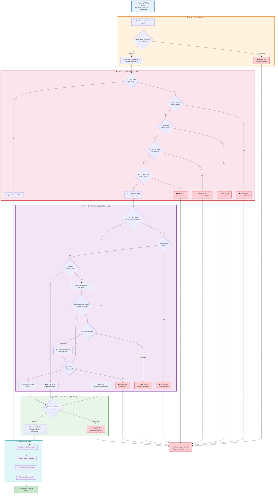

---

## 2. AuthGuard — Flujo interno

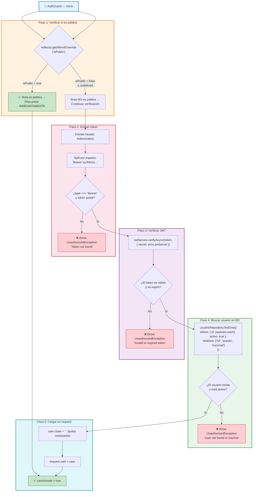

---

## 3. PermissionsGuard — Flujo interno

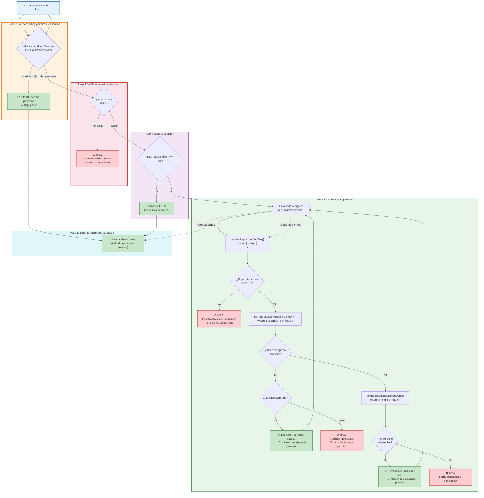

---

## 4. AdminOnlyGuard — Flujo interno

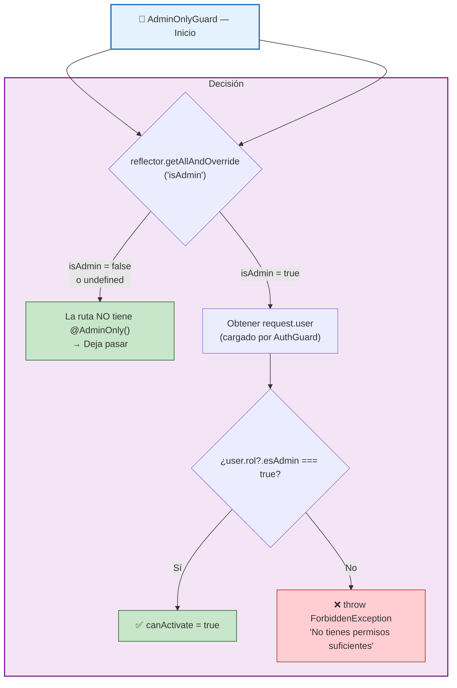

---

## 5. ThrottlerGuard — Flujo interno

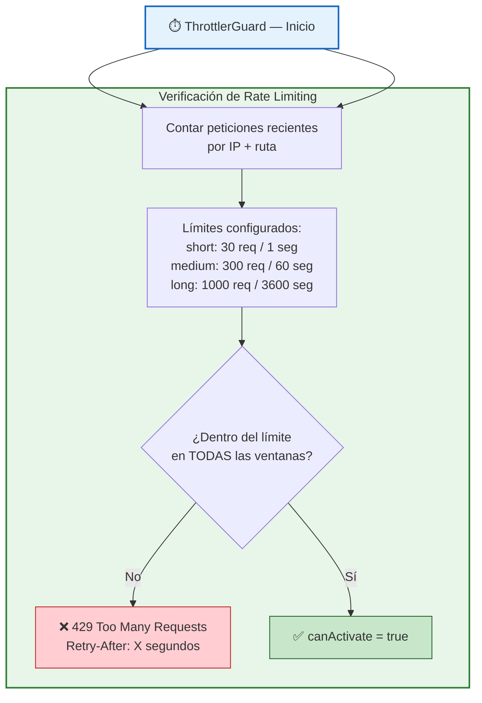

---

## 6. Flujo completo de una petición

### Ejemplo: `DELETE /v1/auth/bitacora/uuid-123` (solo admin)

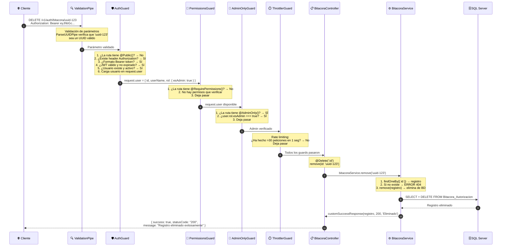

---

## 7. Jerarquía de decisión de permisos

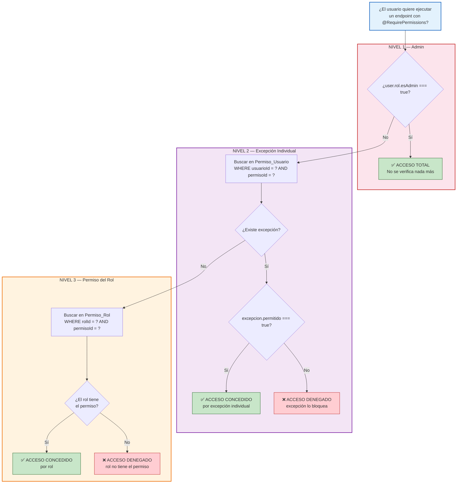

---

## 8. Relación Decorador → Guard → Guard

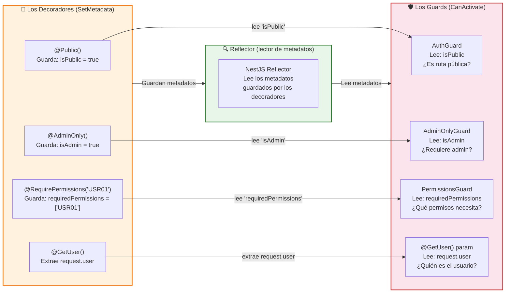

### Ejemplo concreto: Cómo un decorador controla un guard

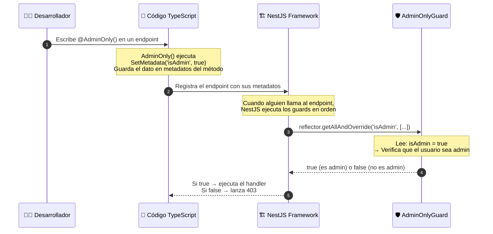

---

## 9. Flujo de Login y generación de JWT

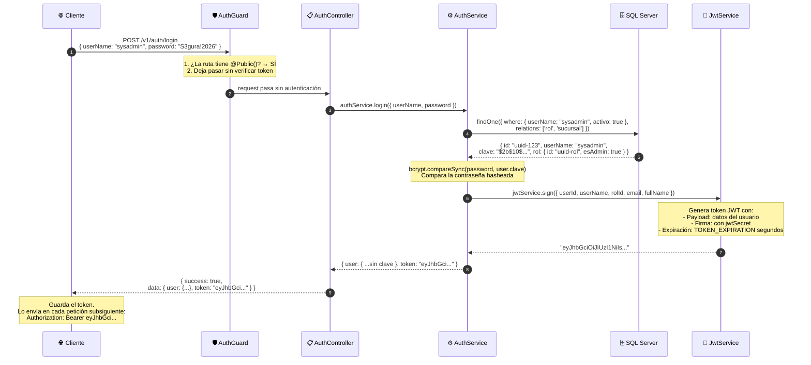

---

## 10. Flujo del módulo Storage con guards

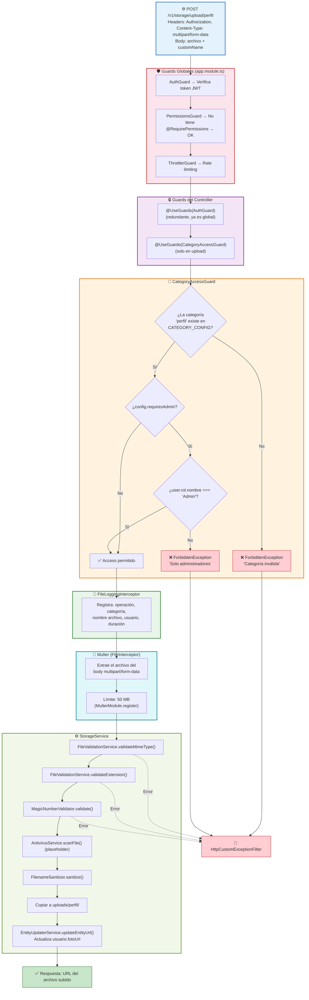

---

## 📊 Resumen de todos los Guards

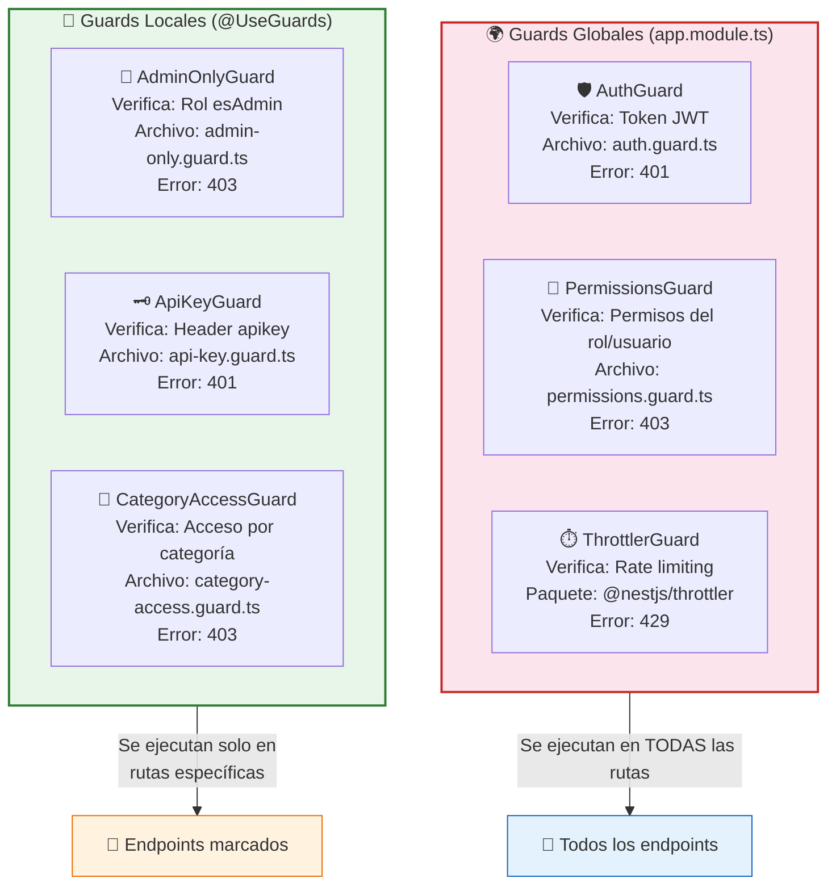

---

## 🧠 Leyenda de colores

| Color | Significado |
|---|---|
| 🔵 Azul claro | Petición inicial o punto de partida |
| 🔴 Rojo claro | Guards de autenticación/seguridad |
| 🟣 Púrpura | Guards de permisos/autorización |
| 🟢 Verde claro | Rate limiting o éxito |
| 🟠 Naranja | Validación o categorías |
| 🟡 Amarillo | Excepciones y errores |
| 🟢 Verde fuerte | Respuesta exitosa |

---

## 📁 Archivos de referencia

| Guard | Archivo | Tipo |
|---|---|---|
| AuthGuard | `src/common/guards/auth.guard.ts` | Global |
| PermissionsGuard | `src/common/guards/permissions.guard.ts` | Global |
| AdminOnlyGuard | `src/common/guards/admin-only.guard.ts` | Local |
| ApiKeyGuard | `src/common/guards/api-key.guard.ts` | Local |
| CategoryAccessGuard | `src/storage/guards/category-access.guard.ts` | Local |
| ThrottlerGuard | Paquete `@nestjs/throttler` | Global |
| HttpCustomExceptionFilter | `src/common/exceptions/http-custom-exception.filter.ts` | Global |
